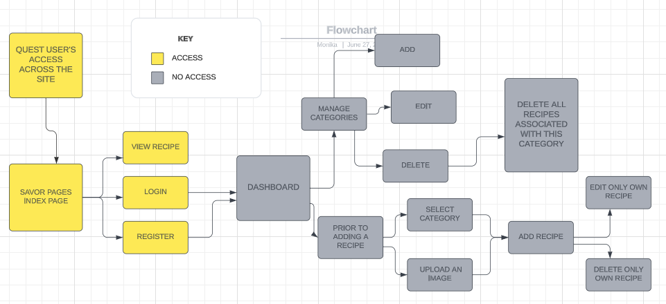
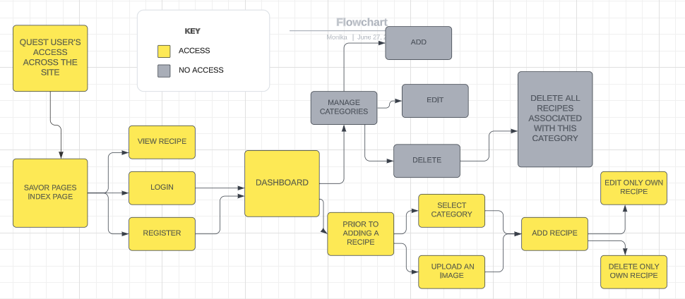
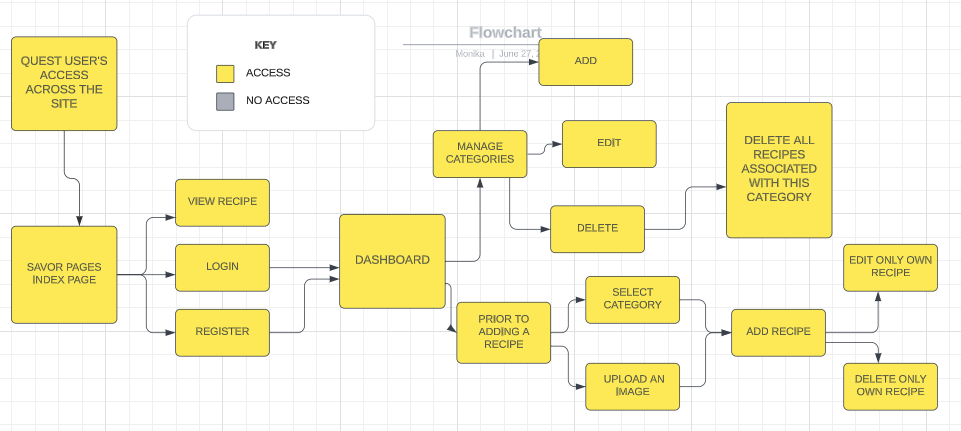
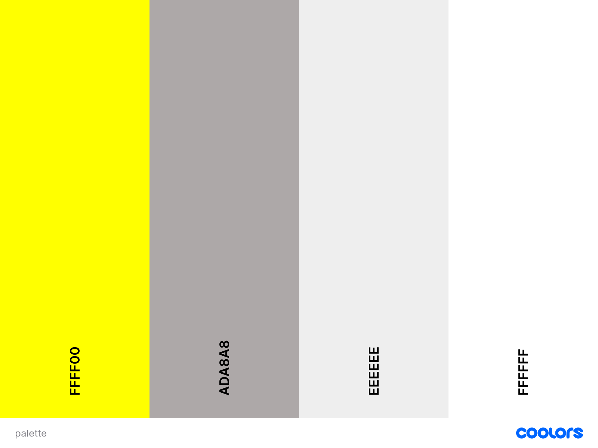
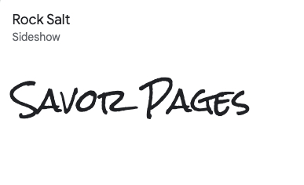

# Savor Pages

## Welcome
Savor Pages is a user friendly website for a food lovers, where you can easily add you recipe, share it with other, edit or delete it. See the live site [here](https://savor-pages.herokuapp.com/).

Mockup image

## Table content

## Project Overwiev
Savor Pages is a recipe sharing and management Application built using Python, Flask+SQLAlchemy, Materialize, Jinja2 and Java Script jQuery. It uses Cloudinary API to manage user-uploaded images.

User Authentication is handled using relational database (PostgreSQL using Flask+SQLAlchemy).
Standard CRUD data manipulation is handled using a relational database Flask+PyMongo.
Savor Pages is my third milestone project for Code Institute's Level 5 Diploma in Web Application Development.

As a lfood lover, but not necessarily cooking chef, the choice of this project was quite an easy decision. A site where everyone can share their ideas for recipes along with ingredients and preparations steps seems to be the perfect idea for someone who loves to eat and is not necessarily a chef, like me.

# User Experience
## Project Goals
* To develop a site where users can easily find food recipes.
* Guest users will be able to view and look through recipes, even without having their own account.
* Registered users will also be able to share and manage their own recipes.
* Use Mobile First design principle in building a responsive site.
* Present the available information in a user friendly way.
* Provide users the option to register and create an account.
* Provide registered users access to a full CRUD functionality.
* Provide all registered users access to a custom user dashboard with read functionality.
* Include defensive programming to enable users to make an informed decision when deleting recipes.
* Handle any errors to help the users understand the issue.
## User stories
### First time User
* Immediately understand the main purpose and use of the site and how to use it.
* Look through all recipes.
* Register/ create a user account.
### Registered User
* Learn more about what I can do on the Savor Pages site.
* Add, edit, retrieve and delete my own recipes.
* Add my own recipes, based on categories.
* Upload an image with my recipes.
* Be able to add additional information about my recipe.
* Have access to tools I may need in order to add, update or delete my recipes.
* Be warned of the consequences of deleting a recipe.
* Have my own member user dashboard (read functionality).
### Admin Goals
* Have the ability to maintain the recipes, in particular the categories
* Add, edit and delete my own recipes
* Add, edit, and delete any recipe by category
## Scope
### Feature Ideas Planning
When planning the App features and scope, I drew up an Importance Viability analysis of these features, please see below:

| # | Feature | Importance | Difficulty |
| --- | --- | --- | --- |
| 1 | View, create, edit and delete recipes | 5 | 5 |
| 2 | View, create, edit and delete images with recipes | 5 | 5 |
| 3 | View, create, edit and delete recipe's category | 5 | 5 |
| 4 | Create, edit and delete account | 5 | 3 |
| 5 | Login and logout to account | 5 | 5 |
| 6 | Moderate content submitted by registered users | 5 | 1 |
| 7 | Send message and/ or feedback to Admin | 5 | 2 |
| 8 | Receive Notifications on users activities | 2 | 2 |
| 9 | Search for Recipes | 5 | 5 |
| 10 | Search Recipes by Ingredients | 3 | 1 |
| 11 | Search Recipes by Category | 5 | 2 |
| 12 | Share Recipes on Social Media | 3 | 3 |
| 13 | Display Suggested Recipes | 3 | 2 |
| 14 | Access to Custom User Dashboard (Read Functionality) | 4 | 5 |
| 15 | User Action Validation | 5 | 5 |

Based on the results of the Feature Ideas Planning, I have decided to attempt to implement features numbers 1, 2, 3, 5, 14 and 15 for this production release and postpone the remaining features due to time limitations.

### Functionality Requirements
* Clean and themed presentation of recipe details.
* Intuitive site navigation.
* Fresh-looking, appetising and themed use of images across the site.
* Full CRUD functionality.
* Use of Defensive Programming to safeguard logged in users againts any unintended result of their actions.
* Solid error handling provide information as well as a much better user experience for any user who may encounter errors when using the site.

## Structure Plan
The yellow elements in these diagrams illustrate the pages that are always accessible from the navbar for all visitors.
The grey elements in these diagrams are the pages not accessible to a particular user.
The view recipes function is available to all visitors.
The add, edit and delete elements are only available to logged in users. The delete functions will return to:
 * A registered user deleting his own recipe will return to a recipe page.
 * An admin deleting the category associated with the recipe will return to a category page.
### Guest user

### Registered User

### Admin user

## Skeleton
### Wireframes
* [DESKTOP - Index page](savorpages/docs/wireframes/dhome.png)
* [DESKTOP - Recipe page](savorpages/docs/wireframes/dhome.png)
* [DESKTOP - Category page](savorpages/docs/wireframes/dhome.png)
* [DESKTOP - Add recipe page](savorpages/docs/wireframes/dhome.png)
* [DESKTOP - Edit recipe page](savorpages/docs/wireframes/dhome.png)
* [DESKTOP - Edit category page](savorpages/docs/wireframes/dhome.png)
* [TABLET - Index page](savorpages/docs/wireframes/dhome.png)
* [TABLET - Recipe page](savorpages/docs/wireframes/dhome.png)
* [TABLET - Category page](savorpages/docs/wireframes/dhome.png)
* [MOBILE - Index page](savorpages/docs/wireframes/dhome.png)
* [MOBILE - Recipe page](savorpages/docs/wireframes/dhome.png)
* [MOBILE - Category page](savorpages/docs/wireframes/dhome.png)
# Design
[Materialize](https://materializecss.com/) was used and customised for the front-end development.
## Colour
The colors used on my website are white, gray and yellow, the background color is usually white and gray, so to brighten up the look of the page, I decided to add yellow details for headings, and buttons border.

## Typography
Fonts was imported from [Google Fonts](https://fonts.google.com/)
* Rock Salt font has been used for heading across the page.

* Sora has been used as a main body font.

* Sans serif is set as a backup if any of the fonts fail to load.
## Images and icons
* Main hero image has been borrowed from Pixabay from [Pexel](https://www.pexels.com/)

* Page logo has been created by myself using [Canva](https://www.canva.com/)

* Every image used for a recipe has been provided from [Pexel](https://www.pexels.com/)
# Features

# Technologies used

# Testing

# Bugs

# Deployment

# Credits

