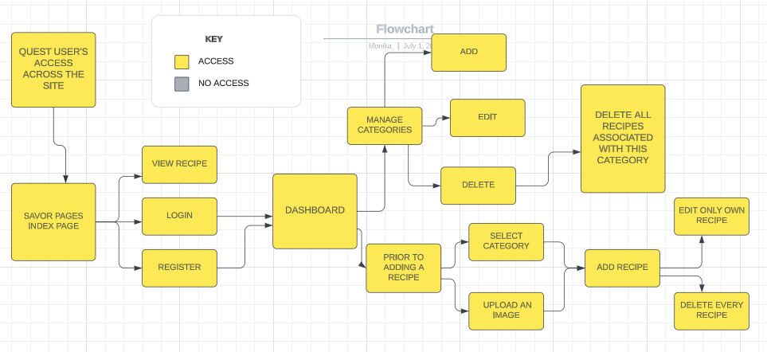
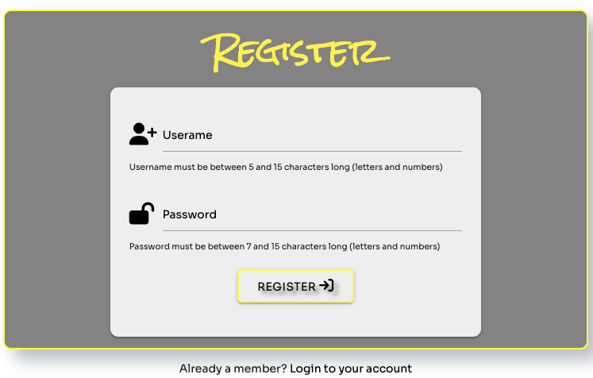
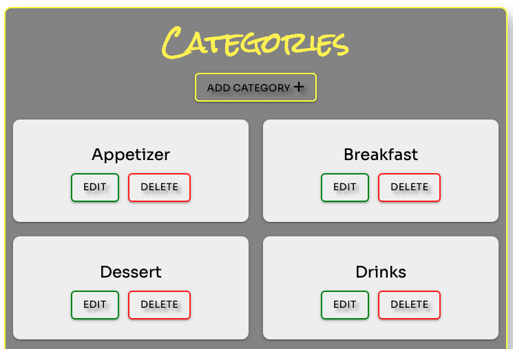

# Savor Pages

## Welcome
Savor Pages is a user friendly website for a food lovers, where you can easily add you recipe, share it with other, edit or delete it. See the live site [here](https://savor-pages.herokuapp.com/).

## Table content

## Project Overwiev
Savor Pages is a recipe sharing and management Application built using Python, Flask+SQLAlchemy, Materialize, Jinja2 and Java Script jQuery. It uses Cloudinary API to manage user-uploaded images.

User Authentication is handled using relational database (PostgreSQL using Flask+SQLAlchemy).
Standard CRUD data manipulation is handled using a relational database with Flask.
Savor Pages is my third milestone project for Code Institute's Level 5 Diploma in Web Application Development.

As a lfood lover, but not necessarily cooking chef, the choice of this project was quite an easy decision. A site where everyone can share their ideas for recipes along with ingredients and preparations steps seems to be the perfect idea for someone who loves to eat and is not necessarily a chef, like me.

# User Experience
## Project Goals
* To develop a site where users can easily find food recipes.
* Guest users will be able to view and look through recipes, even without having their own account.
* Registered users will also be able to share and manage their own recipes.
* Use Mobile First design principle in building a responsive site.
* Present the available information in a user friendly way.
* Provide users the option to register and create an account.
* Provide registered users access to a full CRUD functionality.
* Provide all registered users access to a custom user dashboard with read functionality.
* Include defensive programming to enable users to make an informed decision when deleting recipes.
* Handle any errors to help the users understand the issue.
## User stories
### First time User
* Immediately understand the main purpose and use of the site and how to use it.
* Look through all recipes.
* Login/ create an user account.
### Registered User
* Learn more about what I can do on the Savor Pages site.
* Add, edit and delete my own recipes.
* Add my own recipes, based on categories.
* Upload an image with my recipes.
* Have access to tools I may need in order to add, update or delete my recipes.
* Be warned of the consequences of deleting a recipe.
* Have my own member user dashboard (read functionality).
### Admin Goals
* Have the ability to maintain the categories
* Add, edit and delete my own recipes
* Delete any recipe added by other users
* Delete a category with all recipes associated
## Scope
### Feature Ideas Planning
When planning the App features and scope, I drew up an Importance Viability analysis of these features, please see below:

| # | Feature | Importance | Difficulty |
| --- | --- | --- | --- |
| 1 | View, create, edit and delete recipes | 5 | 5 |
| 2 | View, create, edit and delete images with recipes | 5 | 5 |
| 3 | View, create, edit and delete recipe's category | 5 | 5 |
| 4 | Create, edit and delete account | 5 | 3 |
| 5 | Login and logout to account | 5 | 5 |
| 6 | Moderate content submitted by registered users | 5 | 1 |
| 7 | Send message and/ or feedback to Admin | 5 | 2 |
| 8 | Receive Notifications on users activities | 2 | 2 |
| 9 | Search for Recipes | 5 | 5 |
| 10 | Vote for the favourite recipe | 3 | 4 |
| 11 | Search Recipes by Ingredients | 3 | 1 |
| 12 | Search Recipes by Category | 5 | 2 |
| 13 | Share Recipes on Social Media | 3 | 3 |
| 14 | Display Suggested Recipes | 3 | 2 |
| 15 | Access to Custom User Dashboard (Read Functionality) | 4 | 5 |
| 16 | User Action Validation | 5 | 5 |

Based on the results of the Feature Ideas Planning, I have decided to attempt to implement features numbers 1, 2, 3, 5, 15 and 16 for this production release and postpone the remaining features due to time limitations.

### Functionality Requirements
* Clean and themed presentation of recipe details.
* Intuitive site navigation.
* Fresh-looking, appetising and themed use of images across the site.
* Full CRUD functionality.
* Use of Defensive Programming to safeguard logged in users againts any unintended result of their actions.
* Solid error handling provide information as well as a much better user experience for any user who may encounter errors when using the site.

## Structure Plan
The yellow elements in these diagrams illustrate the pages that are always accessible from the navbar for all visitors.
The grey elements in these diagrams are the pages not accessible to a particular user.
The view recipes function is available to all visitors.
The add, edit and delete elements are only available to logged in users. The delete functions will return to:
 * A registered user deleting his own recipe will return to a recipe page.
 * An admin deleting the category associated with the recipe will return to a category page.
### Guest user
* Yellow --> Access
* Grey --> No access

### Registered User
* Yellow --> Access
* Grey --> No access

### Admin user
* Yellow --> Access
* Grey --> No access

## Skeleton
### Wireframes
#### Mobile 
* [Home](docs/wireframes/homemob.png)
* [Recipe](docs/wireframes/recipemob.png)
* [Profile](docs/wireframes/profilemob.png)
* [Register](docs/wireframes/registermob.png)
* [Category](docs/wireframes/categorymon.png)
* [Edit Recipe](docs/wireframes/editrecipemob.png)

#### Tablet
* [Home](docs/wireframes/hometab.png)
* [Recipe](docs/wireframes/recipetab.png)
* [Profile](docs/wireframes/profiletab.png)
* [Add Recipe](docs/wireframes/addrecipetab.png)
* [Category](docs/wireframes/categorytab.png)

#### Desktop
* [Home](docs/wireframes/home.png)
* [Recipe](docs/wireframes/recipe.png)
* [Category](docs/wireframes/category.png)
* [Add Recipe](docs/wireframes/addrecipe.png)
* [Add Category](docs/wireframes/addcategory.png)
* [Edit Recipe](docs/wireframes/editrecipe.png)
* [Edit Category](docs/wireframes/editcategory.png)
* [Login](docs/wireframes/Login.png)
* [Register](docs/wireframes/register.png)
* [Profile](docs/wireframes/profile.png)

# Design
[Materialize](https://materializecss.com/) was used and customised for the front-end development.
## Colour
The colors used on my website are white, gray and yellow, the background color is usually white and gray, so to brighten up the look of the page, I decided to add yellow details for headings, and buttons border.

## Typography
Fonts was imported from [Google Fonts](https://fonts.google.com/)
* Rock Salt font has been used for heading across the page.

* Sora has been used as a main body font.

* Sans serif is set as a backup if any of the fonts fail to load.
## Images and icons
* Main hero image has been borrowed from Pixabay from [Pexel](https://www.pexels.com/)

* Page logo has been created by myself using [Canva](https://www.canva.com/)
* On desktop screen logo is clickable and redirect to a home page.

* Every image used for a recipe has been provided from [Pexel](https://www.pexels.com/)
* Icons used across the page has been provided from [Font Awesome](https://fontawesome.com/)
# Features
## Favicon 
* As a favicon I wanted to use my own page logo, but it was barely visible, so I decides to use one of the Favicon Emoji from [Favicon](https://favicon.io/).

## Multi Page Element
### Navbar

A Navbar displays on every page, contains:
* Logo
* Home
* Recipes
* Account

### Footer
* Page name
* Page Author
* Current year

### Home/Index page
* Button for recipes
* Button to create an account
* For already logged in user the button will redirect to user's profile page

### Recipe page
* Look through recipes added by other users
* Add recipe button only for logged users

### An account
* Register page - with the link to login page for already registered users

* Login page - with the link to register page for user without an account

## For Registered Users
### Profile page
* All information needed to move around the page
* Recipes added by user

### Add recipe page
* A form contains:
    * Category
    * Recipe name
    * Recipe description
    * Ingredients
    * Preparation
    * Cook Time
    * Image

### Edit a recipe
* Allows the user edit his own recipe (excluding an image, which will be added in the future)

### Delete a recipe
* Allows the user delete his own recipe supported by the defensive function against deleting by the mistake.

### Log out 
* Log out the user and return to login page

## For Admin user only
### Manage recipes
* Delete every recipe
### Manage categories
* Add a category
* Edit a category 
* Delete a category, which also delete all recipes associated with this category

## Error page

* 404 Error - Page not found 
* 400 Error - Bad Request
* 500 Error - Internal Server error

## CRUD Table
This shows what CRUD functionality is available from each page
| Page | Create | Read | Update | Delete |
| --- | --- | --- | --- | --- |
| Home |  | read intro about the app |  |  |
| Recipes |  | look through recipes | edit and update recipe (requires log in & only if owner of the recipe) | delete recipe (requires log in) & only if owner of the recipe or admin|
| Add recipe | choose a category, create a new recipe, upload an image |  |  |  |
| Register | user profile |  |  |  |
| Login |  | username for password check |   |  |  |
| Edit recipe |  | all information about the recipe and image | all information about the recipe |  |
| Categories, only for admin user | categories | all available categories | all available categories | all available categories plus all recipes associated with the deleted category |
| Profile |  | user dashboard, custom information for registered users, view all available recipes shared by the logged in user | edit own recipe functionality available to logged in users from their dashboard | delete own recipe functionality available to logged in users from their dashboard |
## Future Features
I would like to expand the project in the future with following features:
* Allow user delete his own account
* Edit the image along with recipe
* Voting functionality for user's favourite recipe
* Recipe search functionality  
* Add page animation for better UX when viewing the site
# Technologies used
* Language
    * HTML5 - for content and structure of the site
    * CSS3 - for styling the site
    * Vanilla JavaScript - to get current year for the footer
    * jQuery 
        * Mobile side nav
        * Navbar collapsible
        * Navbar dropdown
        * Floating action button
        * Modal pop up window
        * Form dropdown select
    * Python - for the core of the backend of the site 
        * Python Modules Used:
            * blinker==1.6.2
            * click==8.1.3
            * cloudinary==1.33.0
            * Flask==2.3.2
            * Flask-SQLAlchemy==2.5.1
            * greenlet==2.0.2
            * gunicorn==20.1.0
            * importlib-metadata==6.6.0
            * itsdangerous==2.1.2
            * Jinja2==3.1.2
            * MarkupSafe==2.1.2
            * psycopg2==2.9.6
            * SQLAlchemy==1.4.46
            * urllib3==1.26.16
            * Werkzeug==2.3.4
            * zipp==3.15.0
* Tools 
    * [GitHub](https://github.com/) - used to host the site
    * [Git](https://git-scm.com/) -  used for version control and saving work in the repository, using the GitPod extension in Google Chrome to commit to GitHub.
    * [Heroku](https://id.heroku.com/login) - used to deploy the site
    * [Google Chrome Developer Tools](https://developer.chrome.com/docs/devtools/) was used for debugging and testing with Lighthouse
    * [Materialize](https://materializecss.com/) - used for the styling as well as the responsivness of the site
    * [Cloudinary API](https://cloudinary.com/) - used to enable user add his own image to the recipe
    * [Balsamiq](https://balsamiq.com/wireframes/) - used to create a wireframes for this project
    * [Goolge Fonts](https://fonts.google.com/) - Used to select and import font for the project (Rock Salt & Sora)
    * [Font Awesome](https://fontawesome.com/) - used for icons across the site
    * [Favicon](https://favicon.io/) - used for a browser tab icon
    * [Canva](https://www.canva.com/) - used to create a page logo
    * [Convertio](https://convertio.co/) - used to convert images into webp
    * [Lucid Chart](https://www.lucidchart.com/) - used to create a structure diagram for REDAME
    * [MockUp Generator](https://techsini.com/multi-mockup/) - used to create mockup image

# Testing
## All testing undertaken for this project can be found in the [Testing documentation](/TESTING.md)

# Bugs, Issues and Solutions
| # | Bugs, Errors and Issues | Solutions |
| :--- | :--- | :--- |
| 1 | NoneType error object has no attribute 'drivername' when attempting to generate and migrate the models into a new database in Postgres|  After moving my workspace to a GitPod CI Team, I've lost my env.py file and I had to create it again |
| 2 | After added a new column to my models and updated the database, column still couldn't be found | I recreated the database with terminal commands like when creating it first time, but after a little help from Slack community I realize I had to drop the database first with the DROP_DATABASE command, and then create it all again |
| 3 | Edit a recipe by other users | I wasn't aware about a little hack that the user is able to edit other user's recipe by changing the url, I've added a defensive programming to avoid that kind of errors  |
| 4 | Not displaying the recipe's category on recipe page | The categories were not returned in routes.py, adding the 'categories = list(Category.query.order_by(Category.category_name).all())' to the recipe routes fixed the problem|
| 5 | Recipes' images are not displaying properly. Depends of uploaded images and screen size, image is squished or stretched | I use Materialized image card to display recipes, and I hoped the image will render appopriate to the card size, I've set up max-height to the card image, and then the cards display evenly but the bigger images are squished. I've also edited the Cloudinary Upload Manipulation for the image size, but it doesn't seem to work. On the user dashboard I left the note for the best image size to being upload for the best visual effect |
| 6 | No label for select dropdown menu on add recipe form | While validating in WAVE Web AIM, I found that the label associated with Materialize's dropdown select inputs no longer correctly labels the input. This issue arises because Materialize uses JavaScript to create a new text input that lacks the correct ID. Unfortunately, rebuilding the dropdown form input was not feasible due to time constraints. Consequently, this lack of accessibility is regrettable, and in the future, I would consider building my own solution to avoid this problem. |

# Deployment
## Project creation
I used the [CI GitPod Full Template](https://github.com/Code-Institute-Org/gitpod-full-template) to create this project and used GitPod as my IDE.

From the CI GitPod template above the steps to create this project were:
1. Click on 'Use this template' and select 'Create a new repository'
2. Enter your chosen repo name
3. Click 'Create Repository'
4. Click on the green GitPod button
5. Choose New workspace picking first one from the list
6. Click 'Continue'

## Deployment on Heroku
I used Heroku to deploy this project.

To deploy to Heroku:
1. In GitPod CLI, the root directory of the project, run:
    pip3 free --local > requirements.txt
    to create a requirements.txt file containing project dependencies.
2. In the Gitpod project workspace root directory, create a new file called Procfile, with capital 'P'.
    Open the Procfile. Inside the file, check that web: python3 app.py has been added when creating the file
    Save the file.
3. Push the 2 new files to the GitHub repository
4. Login to Heroku, select Create new app, add the name for your app and choose your closest region.
5. Navigate to the Deploy tab on Heroku dashboard and select Github, search for your repository and click 'connect'.
6. Navigate to the settings tab, click reveal config vars and input the following:

| Key | Value |
| :---: | :---: |
| CLOUDINARY_URL | cloudinary |
| DATABASE_URL | postgresql |
| IP | 0.0.0.0 |
| PORT | 5000 |
| SECRET_KEY | mysecretkey |

7. Go back to the Deploy tab and select 'Enable Automatic Deploys'
8. Click deploy branch
9. Click Open app once the build is complete

## Run locally
Note: The project will not run locally with database connections unless the user sets up an env.py file configuring IP, PORT, DATABASE_URL, CLOUDAINRY_API and SECRET_KEY. You must have the connection details in order to do this. These details are private and not disclosed in this repository for security purposes.

To Run Locally:
1. Navigate to the [GitHub Repository](https://github.com/monimaj89/Project3-Savor-Pages)
2. Click on 'Code' & select 'Download Zip' to download the files locally and open with an IDE or Copy the URL from the top box
3. If copying the code open your development editor & in the terminal use the 'Git Clone' command followed by the above URL to create a clone of the project locally.

To Fork Project:
1. Navigate to the [GitHub Repository](https://github.com/monimaj89/Project3-Savor-Pages)
2. Click on the 'Fork' button at the top right of the page
3. This will duplicate the project for you to work on

# Credits
## Code
* The solution to implementing Cloudinary API to allow users to upload images was inspired by my menthor Gareth McGirr and the Code Institute Slack Community, in particular by [Emma Hewson's MP3](https://github.com/emmahewson/mp3-swimmon)

## Content
* Sample recipes poster on Savor Pages were sourced from [Simple Recipes](https://www.simplyrecipes.com/)

## Images
Images for a hero image as well as for a recipes were borrowed from [Pexel](https://www.pexels.com/)
* [Hero Image by Pixabay](https://www.pexels.com/@pixabay/)
* [Fuzzy Navel by Lisa Fotios](https://www.pexels.com/@fotios-photos/)
* [Banana Pancakes by Natalie](https://www.pexels.com/@ikisik/)
* [Burger by Valeria Boltneva](https://www.pexels.com/@valeriya/)
* [Banoffee Pie by Los Muertos Crew](https://www.pexels.com/@cristian-rojas/)
* [Pumpkin Soup by Pixabay](https://www.pexels.com/@pixabay/)
* [Crispy Shrimp Dumpling by Kaysha](https://www.pexels.com/@kaysha-147543/)

## Acknowledgements

* My mentor [Gareth McGirr](https://github.com/Gareth-McGirr) for all his help and advice throughout the project
* The whole team at [Code Institute](https://codeinstitute.net/) for their teaching and support
* Slack Community always so helpful and patient.

[Go to Top](#savor-pages)
