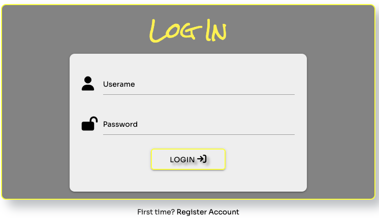
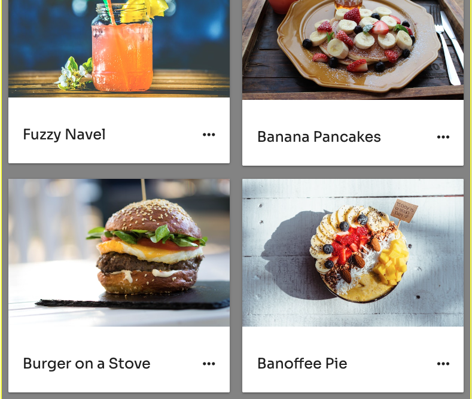
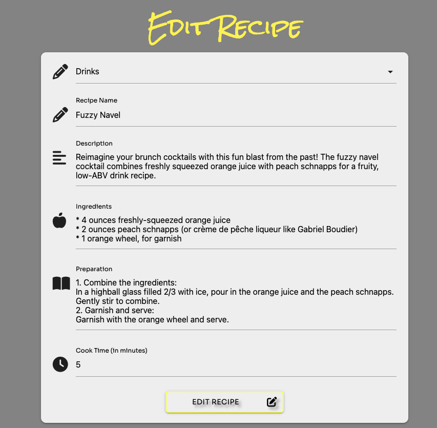

This is the testing documentation for my web application Savor Pages. Full [README available here](/README.md)
See the live site [here](https://savor-pages.herokuapp.com/).

# Manual Testing
| **Test**| **Goal** | **Result** |
| :--- | :--- | :--- |
| savorpages logo renders across all possible device | Logo displays on the top left side of the navbar on desktop, and on tablet, and mobile logo is hidden in the sidenav menu  | Pass |
| Clickable logo | On desktop logo is clickable and redirect to the home page | Pass
| Responsiveness | Site to be responsive across all device | Pass |
| Flash Messages | Messages successfully display with relevant information for user  | Pass |
| Choose Category from dropdown | Categories should be available to choose from | Pass |
| Main Navlinks | Navlinks to work and not hiding a 500 internal server error | Pass |
| Category ID | This gets stored as category_id and display for every recipe added | Pass |
| Associated Recipes | These get deleted when a category relevant to them is deleted by admin | Pass |
| Modal is semantically correct | All HTML Validation to Pass and modal works with out causing a 500 Internal Server Error | Pass |

# Validation 
## HTML Validation
The initial test of the page validated by URL using [W3C HTML Validator](https://validator.w3.org/#validate_by_uri) showed two errors:
* Empty id and class attribuite for an "ul" element - which was unnecessary and has been deleted.
* Stray "ul" and "li" element - were misplaced in the code and were fixed

And two warnings:
* Section lacks heading - which has been change to a div element withouth any changes to page layout
* The "type" attribute unnecessary for JavaScript resources - which concerned my jquery script from materialize and has been deleted

Every other page was run through the HTML validator using source code, and all pages passed, except as desribes by the pages below
* [Home](docs/htmlhome.png)
* [Recipes](docs/htmlrecipes.png)
* [Add Recipe](docs/htmladdrecipe.png) - 1 error - fix - added an alt attribute to the image
* [Edit Recipe](docs/htmleditrecipe.png)
* [Category](docs/htmlcategory.png)
* [Add Category](docs/htmladdcategory.png)
* [Edit Category](docs/htmleditcategory.png)
* [Profile](docs/htmlprofile.png) - 1 error - fix - added an alt attribute to the image
* [Register](docs/htmlregister.png)
* [Login](docs/htmllogin.png)
* [Error](docs/htmlerror.png)

## CSS Validation
I run the CSS code through [W3C CSS Validator](https://jigsaw.w3.org/css-validator/#validate_by_input) and showed no errors
* [CSS Validation result](docs/cssvalidate.png)
* [CSS Validation warnings](docs/csswarning.png) - Added quotation marks to font names

## JavaScript Linting
I ran the JavaScript code through [JSHint](https://jshint.com/), which showed no errors or warnings
* [JavaScript test result](docs/jshint.png)

## Python Linting
I ran the code through [CI Python Liner](https://pep8ci.herokuapp.com/), which showed one error:
* [Line 189: E117 over-indented](docs/python.png) - I am aware of that error since I build the Login functionality, unfortunatelly I couldn't find any solution for that, I've tried to different approach with indentation, and also search for help online, but as long as code is working I've decided leave it like that

## Lighthouse Testing
* [Home](docs/home.png)
* [Recipes](docs/h.png)
* [Add Recipe](docs/ht.png)
* [Edit Recipe](docs/ht.png)
* [Category](docs/html.png)
* [Add Category](docs/html.png)
* [Edit Category](docs/htmled.png)
* [Profile](docs/.png)
* [Register](docs/htmlre.png)
* [Login](docs/ht.png)
* [Error](docs/or.png)

## Wave Testing
I ran the site through the [Wave Web Accessibility Evaluation Tool](https://wave.webaim.org/). There were some minor errors & alerts which I was unable to fix which are detailed in the notes below. Based on the research done in to these errors, and the fact that they are mostly part of the external code which I have no control I have accepted them and marked the tests as passed for the purposes and scope of this project. Full results below.
* [Home](docs/homewave.png) - Empty link errors for a floating action button, which are additional buttons for register and login forms, and use only icons
* [Recipes](docs/recipewave.png)
* [Add Recipe](docs/addrecipewave.png) - Missing Form Label error on dropdown menu caused by Materialized JavaScript code creating a new input element when dropdown is populated
* [Edit Recipe](docs/editrecipewave.png) - Missing Form Label error on dropdown menu caused by Materialized JavaScript code creating a new input element when dropdown is populated
* [Category](docs/categorywave.png)
* [Add Category](docs/addcategorywave.png)
* [Edit Category](docs/editcategorywave.png)
* [Profile](docs/profilewave.png)
* [Register](docs/registerwave.png)
* [Login](docs/loginwave.png)
* [Error](docs/errorwave.png)

# Responsivness
Responsive design testing has been carried out on different devices and screen sizes using [Chrome DevTools](https://developer.chrome.com/docs/devtools/)
### Mobile
* [Profile](docs/responsiveness/mobileprofile.png)
* [Home](docs/responsiveness/mobilehome.png)
* [Recipe](docs/responsiveness/mobilerecipe.png)
* [Login](docs/responsiveness/mobilelogin.png)

### Tablet
* [Home](docs/responsiveness/tablethome.png)
* [Add Recipe](docs/responsiveness/tabletaddrecipe.png)
* [Profile](docs/responsiveness/tabletprofile.png)
* [Profile - tablet2](docs/responsiveness/nesthubmaxprofile.png)

### Desktop
* [Profile](docs/responsiveness/desktopprofile.png)
* [Recipe](docs/responsiveness/desktoprecipe.png)
* [Category](docs/responsiveness/desktopcat.png)
* [Register](docs/responsiveness/desktopregister.png)

# Testing User Stories 
## First Time User

|   Target      |   Outcome     | Image |
| ------------- |-------------| -----------|
| 1. Immediately understand the main purpose and use of the site and how to use it  | Find a recipe button which redirect to a recipe page and an additional button to create an account |  |
| 2. Look through all recipes | Click on 'FIND A RECIPE' button to visit a recipe page with all available recipes | |
| 3. Add a recipe | On recipe page there is a button to add a recipe available to see for everybody but not logged user will be redirect to login page with message to login to add a recipe | |
| 4. Login/ create an user account | Click on the account icon to display another two icons, one for register and one for login, which will redirect to the appropriate forms. For already logged in user the action button will redirect to an user's profile page  |   |
| 5. Switch between register and login forms | Both forms provide a link to switch between pages. For already registered user, below register form, link redirects to a login form, and for first time visitor who got lost on login page, link redirects to a register form |   |

----

## Registered User

|   Target      |   Outcome     | Image |
| ------------- |-------------| -----------|
| 1. Learn more about what I can do on the Savor Pages site. | From the User Dashboard (Profile Page) registered users are provided additional information about what they are able to do when using the site |  |
| 2. Add a recipe |'ADD RECIPE' button (on navbar, on recipe page, or on profile page) redirects to a form where user can add a recipe based on a category. |  |
| 3. Add a recipe without any blank fields | All fields are required to succesfully add a recipe. Not filling all the fields will show a warning note (not choosing the category will result with a console error) ||
| 4. Add an image to recipe | A recipe image has been introduced by myself as an additional function for the better visual effect of the recipe. It isn't the perfect functionality, because depending of the image size and screen size, an image can be squished or stretched. Based on my observations the best image size to display properly is 600x400 |  |
| 5. Edit your own recipe | User can edit his own recipe, including, changing the category, and any other fields except an image (future feature) The message about succesfully updated recipe will be display above the form |    |
| 6. Edit other user's recipe  | The defensive programming has been used to protect the recipes being edited by other users changing the number of recipe in the url address |  |
| 7. Delete a recipe | User can delete his own recipe and will be warned about the action before deleting | |
| 8. Have access to tools user may need in order to add, update or delete the recipe | There are three button across the page to add a recipe, and below user's recipe there are buttons for edit and delete his own recipe |   |
| 9. Log out | Navbar provides a Log out button for user to leave his account, which redirects back to Login form and flash a message for user being logged out | |

---- 

## Admin user

|   Target      |   Outcome     | Image |
| ------------- |-------------| -----------|
| 1. Have the ability to maintain the categories | Admin user can add, edit and delete the categories |  |
| 2. Add the category | On category page, by 'ADD CATEGORY' button, admin can add a new category | |
| 3. Edit a category| Admin can edit any category | |
| 4. Delete a category | Admin can delete any category including all recipes associated with this category. Pop up window will display the warning message  | |
| 5. Delete every recipe | Admin can delete any recipe created by other users  | |